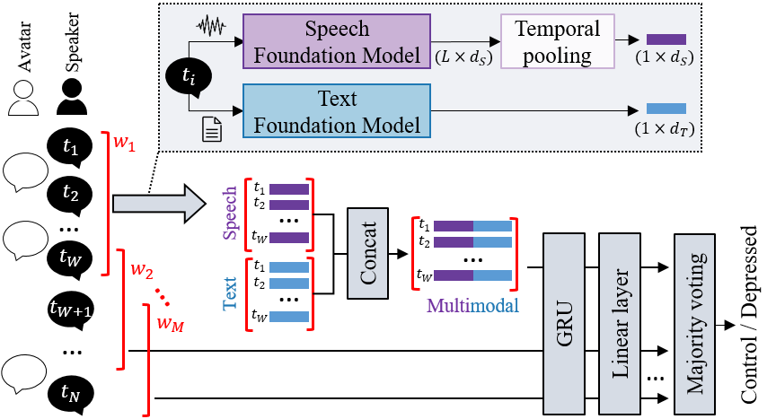

# Depression Detection
This repository contains the code for the INTERSPEECH 2025 paper: 

**"Speech and Text Foundation Models for Depression Detection: Cross-Task and Cross-Language Evaluation"**

### Abstract

<p align="justify">
Automated depression detection is gaining attention due to its potential to improve psychiatric care. This study compares the performance of foundation models (FMs) in two datasets: an extended Distress Analysis Interview Corpus (DAIC+) in English, and Depressive Indicators during Casual Talks (DEPTALK) dataset in Spanish. HuBERT models and their fine-tuned versions for emotion recognition (ER) are used for speech. RoBERTa models and their ER variants are applied for text. Representations from FMs are grouped into context windows and processed by a Gated Recurrent Unit. Early fusion is used for multimodal analysis. Speech models perform similarly across datasets (F1$\approx$0.60). Text models perform better on DAIC+ than on DEPTALK (F1=0.70 vs 0.45). Multimodal models using FMs fine-tuned for ER perform best for both (F1=0.75 in DAIC+, 0.69 in DEPTALK), showing effectiveness across tasks and languages. Fairness evaluation reveals gender bias, which motivates future research on its alleviation. 
</p>

<p align="center">
  
</p>


## Files and folders
* **extract_embeddings.py**: This script is designed to extract embeddings (numerical representations) from speech and text data using pre-trained models from the HuggingFace library. It includes specific functions for handling the two datasets (DEPTALK and DAIC), creating embeddings for each participant utterance (for each interviews in DAIC+, and for each of the six conversations in DEPTALK). The two main functions are:
  * *get_speech_embedding*: Extracts hidden states from the final hidden layer of the model, or from a specific layer X if specified in the model name (e.g., '_LX'). It then averages these hidden states over the time dimension to produce a speech embedding of fixed dimensions.
  * *get_text_embedding*: Extracts the [CLS] token embedding from a text string.
* **context_windows.py**: This code provides functionality to process embeddings by slicing them into overlapping context windows and saving the processed data for further analysis. It includes two functions for handling the two datasets (DEPTALK and DAIC) and a utility function for creating context windows, defined below:
  * *create_context_windows*: slices a given array into overlapping windows of a specified size (window_size) with a defined step (hop_length). Particularly, it creates windows of W consecutive turns in a dialogue (see the figure above).
* **modeling.py**: This script implements a deep learning pipeline for training and evaluating GRU models on multimodal data (speech, text, or both) to predict depression (classification based on binarizing PHQ scores). It includes functions for handling the two datasets (DEPTALK and DAIC) and uses embeddings as input features. The pipeline includes data preparation, model training, evaluation, and experimentation with hyperparameters.

<!-- * requirements.txt: required packages to be installed. -->

## Data
The paper applied depression detection models to two datasets:
* ➡️ **DAIC+**: an extension of the well-known DAIC corpus, featuring 459 semi-structured clinical interviews conducted primarily by a virtual agent (in English). This project also incorporates two publicly available subsets: DAIC-WOZ and E-DAIC. You can request access to the data at https://dcapswoz.ict.usc.edu/. The code in this repository expects the DAIC+ data to be organized in the following directory structure:
```
<root_folder>/
├── Audios/
│   ├── <user_id>_AUDIO.wav
│   └── ...
├── Transcriptions/
│   ├── <user_id>_P.tsv (optional)
│   ├── <user_id>_G_ASR.csv
│   └── ...
```

* ➡️ **DEPTALK**: a dataset capturing casual conversations between 101 participants and fully automated virtual humans expressing various emotions (in Spanish). This dataset is private and not publicly available. The code in this repository expects the DEPTALK data to be organized in the following directory structure:
```
<root_folder>/
├── <user_id>_Conversations/
│   ├── <user_id>_<avatar_id>/
│   │   ├── Audios/
│   │   │   ├── Subject_<user_id>_T=<order_id>.wav
│   │   │   └── ...
│   │   └── Conv_<avatar_id>.csv
│   └── ... 
└── ...
```

## Citation
If you find this work helpful, please cite our work as:

<!--
Gómez-Zaragozá, L., Marín-Morales, J., Alcañiz, M., Soleymani, M. (2025) Speech and Text Foundation Models for Depression Detection: Cross-Task and Cross-Language Evaluation. Proc. INTERSPEECH 2025, XXXX-XXXX, doi: 

```
 @inproceedings{gomezzaragoza23_interspeech,
  author={Lucía Gómez-Zaragozá and Simone Wills and Cristian Tejedor-Garcia and Javier Marín-Morales and Mariano Alcañiz and Helmer Strik},
  title={{Alzheimer Disease Classification through ASR-based Transcriptions: Exploring the Impact of Punctuation and Pauses}},
  year=2023,
  booktitle={Proc. INTERSPEECH 2023},
  pages={2403--2407},
  doi={10.21437/Interspeech.2023-1734}
}
```

-->
